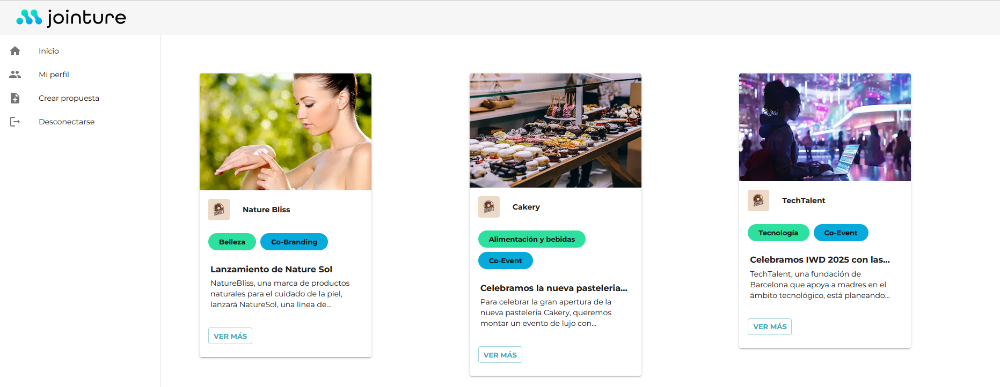
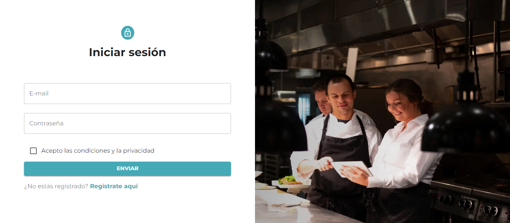
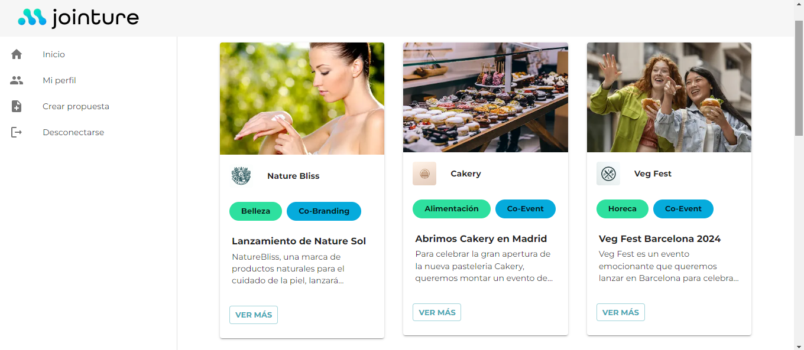
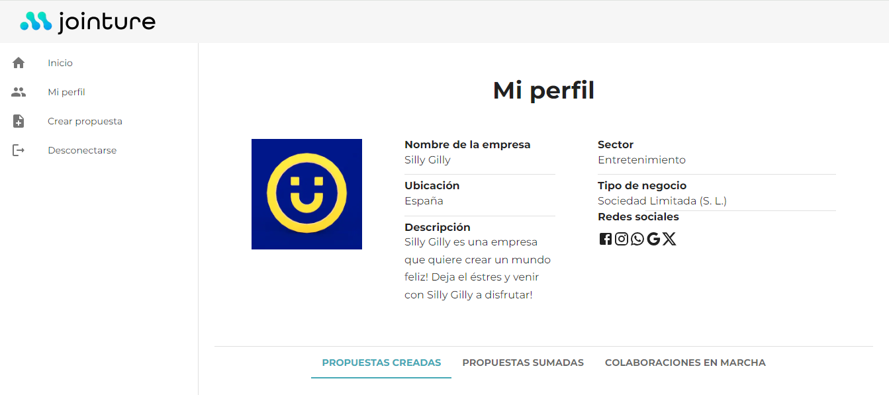

# 👥🤝 Project - Jointure Platform


Jointure is a platform that automates collaborations between brands from various sectors, facilitating seamless interactions and partnerships. This README provides an overview of the project's structure, technologies used, features, installation instructions, and contribution details.



## 📌 Requirements
- Visual Studio Code
- Node.js installed on the computer
- PHPMyAdmin

## 🚀 Technologies Used:

- Frontend:
  - Next.js
  - React.js
  - Tailwind CSS
  - Material-UI (MUI)
  - Axios
  - Jest
  - Cypress
- Backend:
  - PHP
  - Laravel
  - Laravel Fortify
  - Laravel Jetstream
  - PHPUnit

## 📁 Backend File Structure:

- **.github:** Auto-generated files.
- **app:** Houses the majority of the application's logic, including models, controllers, middleware, and other PHP classes.
- **bootstrap:** Responsible for bootstrapping the Laravel framework and starting the application. 
- **config:** Allows to configure aspects such as database connections, cache settings, session drivers...
- **database:** Contains all the files related to database operations including migrations, factories and seeders.
- **public:** Unused in this project as we use NextJs with React in frontend.
- **resources:** Contains assets.
- **routes:** Defines the endpoints of the application and specify which controller method should handle each endpoint. It supports both web routes and API routes.
- **storage:** Contains files generated by the application, such as log files, session files. The uploaded images are also stored in this folder.
- **tests:** Automated tests.
  

## 📚 Features:

- **User:** Login and registration functionalities.
- **Profile:** Each user has a business profile that can be modified.
- **Collaboration Proposals:** Users can create, edit, delete their proposals.
- **Collaborations:** Users can apply and participate to proposals.


## ⚙️ Installation
To install this repository on your computer, follow these steps:

1. Clone the repository:
    ```bash
    git clone https://github.com/octocodevs/jointure-backend.git
    ```
2. Put in the terminal within the project
    ```bash
    cd jointure-backend
    ```
    ```bash
    composer install
    ```
3. Run the database (if using XAMP : Start, then Admin the MySQL DB)
    
4. Run the project, 
    ```bash
    php artisan serve  
   
    ```
5. Migrate and seed your database 
    ```bash
    php artisan migrate:fresh --seed
    ```
   


> [!IMPORTANT]
>
> ## 🚨 API DOC
Here is the link to the documentation of the API. You may use Postman application to check the functions

🔗 [API DOC link ]() 🔗

> 
> ## 🚨 Frontend Repository
Here is the link to our Backend repository if you want to use it with this Backend:

🔗 [Frontend link ](https://github.com/octocodevs/jointure-frontend) 🔗


## 🧪 Running Tests

To run tests, run the following command

   ```bash
   php artisan test
   ```

## Demo






## 👩‍💻 Developers

**Back-end Team:**

Laura Artaza - [Linkedin profile](https://www.linkedin.com/in/laura-artaza/)

Melissa Casola - [Linkedin profile](https://www.linkedin.com/in/melissa-casola/)

Zohra Bellamine - [Linkedin profile](https://www.linkedin.com/in/z-bellamine/)


**Front-end Team:**

Stephanie Céspedes - [Linkedin profile](https://www.linkedin.com/in/stephanie-cespedes/)

Grecia Landazuri - [Linkedin profile](https://www.linkedin.com/in/grecialh/)

Carolina Delfa - [Linkedin profile](https://www.linkedin.com/in/carolina-delfa-silvestre/)

Vicki Robertson - [Linkedin profile](https://www.linkedin.com/in/vickirobertson/)

Gabriela Irimia  - [Linkedin profile](https://www.linkedin.com/in/gabriela-irimia/)


