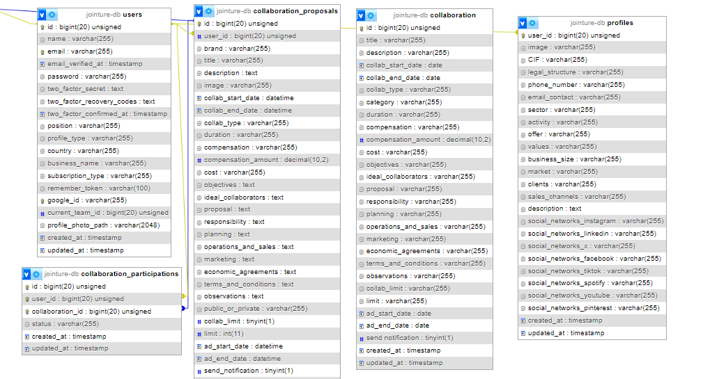

# 👥🤝 Project - Jointure Platform


Jointure is a platform that automates collaborations between brands from various sectors, facilitating seamless interactions and partnerships. Alongside [this frontend repository](https://github.com/octocodevs/jointure-frontend/tree/main), this fullstack project involves the creation of a responsive website that allows users to explore, create, and manage collaborations.


## Table of Contents

- [Requirements](#requirements)
- [Technologies](#technologies)
- [Backend File Structure](#backend-file-structure)
- [Features](#features)
- [Database Diagram](#database-diagram)
- [Installation](#installation)
- [API Doc](#api-doc)
- [Running Tests](#running-tests)
- [Demo](#demo)
- [Developers](#developers)

## Requirements

- Visual Studio Code
- Node.js 
- Composer
- Xampp or mamp

## Technologies:

- Frontend:
  - Node.Js -> 20.0.0
  - Next.js -> 14.1.4
  - React.js -> 18.0.0
  - Tailwind CSS -> 3.3.0
  - Material-UI (MUI) -> 5.15.11
  - Axios -> 1.6.8
  - Jest -> 29.7.0
  - Cypress -> 13.7.2

- Backend:
  - PHP -> 8.0
  - Laravel -> 10.0.0
  - PHPUnit -> 7.1
  - Composer -> 2.6.6
  - MySQL -> 8.0
  - Sanctum -> 3.3

## Backend File Structure:

- **.github:** Auto-generated files.
- **app:** Houses the majority of the application's logic, including models, controllers, middleware, and other PHP classes.
- **bootstrap:** Responsible for bootstrapping the Laravel framework and starting the application. 
- **config:** Allows to configure aspects such as database connections, cache settings, session drivers...
- **database:** Contains all the files related to database operations including migrations, factories and seeders.
- **public:** Unused in this project as we use NextJs with React in frontend.
- **resources:** Contains assets.
- **routes:** Defines the endpoints of the application and specify which controller method should handle each endpoint. It supports both web routes and API routes.
- **storage:** Contains files generated by the application, such as log files, session files. The uploaded images are also stored in this folder.
- **tests:** Automated tests.
  

## Features:

- **User:** Login and registration functionalities.
- **Profile:** Each user has a business profile that can be modified.
- **Collaboration Proposals:** Users can create, edit, delete their proposals.
- **Collaborations:** Users can apply and participate to proposals.

## Database Diagram:

This data base diagram shows that there is a one to many relationship as single users can create an unlimited number of proposals to collaborate. The primary keys of the users, profiles, and proposals tables are their ids while the foreign key "user_id" on profiles, proposals, and collaborations connect all these tables, ensuring that the user's id is attached to everything they create, identifying them as the only ones able to edit or delete their profile and proposals.  




## Installation
To install this repository on your computer, follow these steps:

1. Clone the repository:
    ```bash
    git clone https://github.com/octocodevs/jointure-backend.git
    ```
2. Put in the terminal within the project
    ```bash
    cd jointure-backend
    ```
    ```bash
    composer install
    ```
3. Run the database (if using XAMP : Start, then Admin the MySQL DB)
    
4. Run the project, 
    ```bash
    php artisan serve  
   
    ```
5. Migrate and seed your database 
    ```bash
    php artisan migrate
    ```
5. Create and seed your database 
    ```bash
    php artisan db:seed --class=UserSeeder
    ```
   ```bash
    php artisan db:seed --class=ProfileSeeder
    ```
    ```bash
    php artisan db:seed --class=ProposalSeeder
    ```
   
>
> ## API DOC
Here is the link to the documentation of the API. You may use Postman application to check the functions

🔗 [API DOC link ]() 🔗


## Running Tests

To run tests, run the following command

   ```bash
   php artisan test
   ```

## Demo


## Developers

[Zohra Bellamine](https://www.linkedin.com/in/z-bellamine/) <br>
[Melissa Casola](https://www.linkedin.com/in/melissa-casola/) <br>
[Laura Artaza](https://www.linkedin.com/in/laura-artaza/) <br>
[Stephanie Céspedes](https://www.linkedin.com/in/stephanie-cespedes/) <br>
[Vicki Robertson](https://www.linkedin.com/in/vickirobertson/) <br>
[Grecia Landazuri](https://www.linkedin.com/in/grecialh/) <br>
[Carolina Delfa](https://www.linkedin.com/in/carolina-delfa-silvestre/) <br>
[Gabriela Irimia](https://www.linkedin.com/in/gabriela-irimia/) <br>


---

Back to: [Table of Contents](#table-of-contents)
